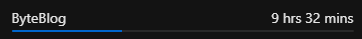

# ByteBlog - React & Appwrite Blog Platform

## Table of Contents
1. [Project Overview](#project-overview)
2. [Technical Stack](#technical-stack)
3. [Project Structure](#project-structure)
4. [Setup & Installation](#setup--installation)
5. [Configuration](#configuration)
6. [Features & Components](#features--components)
7. [Authentication Flow](#authentication-flow)
8. [Database Schema](#database-schema)
9. [API Integration](#api-integration)
10. [Deployment Guide](#deployment-guide)
11. [Security Considerations](#security-considerations)
12. [Troubleshooting](#troubleshooting)

---

## Project Overview
ByteBlog is a modern blogging platform built with React and Appwrite. It provides a full-featured blogging experience with user authentication, post creation/editing, image uploads, and rich text editing.

## Project Time  
  
The total time spent on the project is 29 hours and 8 minutes.

## 🌟 Show Your Support
If you found this project helpful, give it a ⭐️!

## Technical Stack
### Frontend:
- React 18.2.0
- Redux Toolkit for state management
- React Router v6 for routing
- TinyMCE for rich text editing
- Tailwind CSS for styling

### Backend:
- Appwrite for backend services
- Appwrite Storage for file management
- Appwrite Authentication

### Build Tools:
- Vite
- PostCSS
- ESLint

## Project Structure
```
/src
  /appwrite        - Appwrite service configurations
  /components      - Reusable React components
  /pages           - Page components
  /store           - Redux store configuration
  /conf            - Environment configuration
```

## Setup & Installation
### Local Development:
```bash
git clone https://github.com/yourusername/ByteBlog.git
cd ByteBlog
npm install
cp .env.sample .env
# Configure your .env file with Appwrite credentials
npm run dev
```

## Configuration
### Required Environment Variables:
```env
VITE_APPWRITE_URL=<Appwrite API endpoint>
VITE_APPWRITE_PROJECT_ID=<Your Appwrite project ID>
VITE_APPWRITE_DATABASE_ID=<Database ID for blog posts>
VITE_APPWRITE_COLLECTION_ID=<Collection ID for posts>
VITE_APPWRITE_BUCKET_ID=<Storage bucket ID>
VITE_TINY_CLOUD_API_KEY=<TinyMCE API key>
```

## Features & Components
### Authentication:
- User signup/login
- Protected routes
- Session management

### Blog Management:
- Create/Edit/Delete posts
- Rich text editor
- Image upload
- Post preview

### Components:
- `AuthLayout`: Handles authentication state
- `PostForm`: Manages post creation/editing
- `RTE`: Rich text editor wrapper
- `Header/Footer`: Navigation components

## Authentication Flow
1. User signs up/logs in
2. Appwrite creates session
3. Redux store updates auth state
4. Protected routes become accessible

## Database Schema
### Posts Collection:
| Field         | Type    | Description              |
|--------------|--------|--------------------------|
| title        | string | Post title               |
| content      | string | Blog content             |
| slug         | string | Unique post slug         |
| featuredImage | string | File ID for the image   |
| status       | string | Active/inactive status   |
| userId       | string | Owner of the post       |

## API Integration
### Appwrite Services:
- `auth.js`: Authentication methods
- `config.js`: Database and storage operations

## Deployment Guide (AWS)
### Prerequisites:
- AWS account
- AWS CLI configured
- Node.js 14+ installed

### Steps for AWS Deployment:
#### 1. Build the Application:
```bash
npm run build
```

#### 2. S3 Bucket Setup:
- Create an S3 bucket
- Enable static website hosting
- Configure bucket policy:
```json
{
  "Version": "2012-10-17",
  "Statement": [
    {
      "Effect": "Allow",
      "Principal": "*",
      "Action": "s3:GetObject",
      "Resource": "arn:aws:s3:::your-bucket-name/*"
    }
  ]
}
```

#### 3. CloudFront Distribution:
- Create distribution
- Point to S3 bucket
- Configure SSL certificate
- Set up custom domain (optional)

#### 4. Deploy to S3:
```bash
aws s3 sync dist/ s3://your-bucket-name
```

#### 5. Configure Route 53 (Optional):
- Create a hosted zone
- Add an A record pointing to CloudFront

#### 6. Set up CI/CD (Optional):
```yaml
name: Deploy to AWS
on:
  push:
    branches: [ main ]
jobs:
  deploy:
    runs-on: ubuntu-latest
    steps:
      - uses: actions/checkout@v2
      - name: Install dependencies
        run: npm install
      - name: Build
        run: npm run build
      - name: Deploy to S3
        run: aws s3 sync dist/ s3://your-bucket-name
```

## Security Considerations
- Enable CORS on Appwrite
- Configure Content Security Policy
- Enable AWS WAF on CloudFront
- Regular dependency updates
- Environment variable protection

## Troubleshooting
### Common Issues:
#### 1. Authentication Errors:
- Verify Appwrite credentials
- Check CORS settings
- Validate session handling

#### 2. Image Upload Issues:
- Confirm bucket permissions
- Check file size limits
- Verify storage rules

#### 3. Deployment Problems:
- Clear CloudFront cache
- Check S3 bucket permissions
- Verify build output

### Performance Optimization:
- Enable CloudFront compression
- Implement image optimization
- Configure caching headers

### Monitoring:
- Set up CloudWatch metrics
- Configure error alerting
- Monitor API usage

## Support
For issues and feature requests, please create an issue in the GitHub repository.

## 👤 Author
**Syed Tasavour**  
- GitHub: [@syedtasavour](https://github.com/syedtasavour)
- Portfolio: [syedtasavour.me](https://syedtasavour.me)


## 📞 Contact
For any queries or support:
- Email: `help@syedtasavour.me`
- GitHub Issues: [Create an issue](https://github.com/syedtasavour/backend-VidEngine/issues)

  <div align="center">
  <sub>Built with passion (and a lot of coffee) by Syed Tasavour.</sub>
</div>
